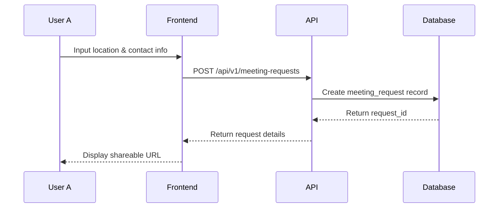
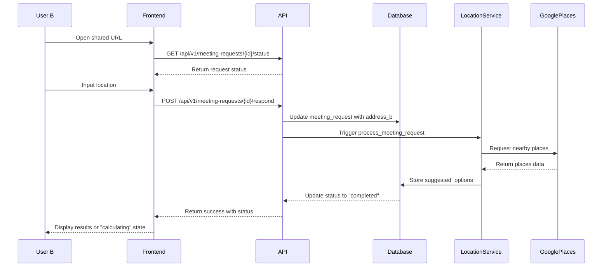
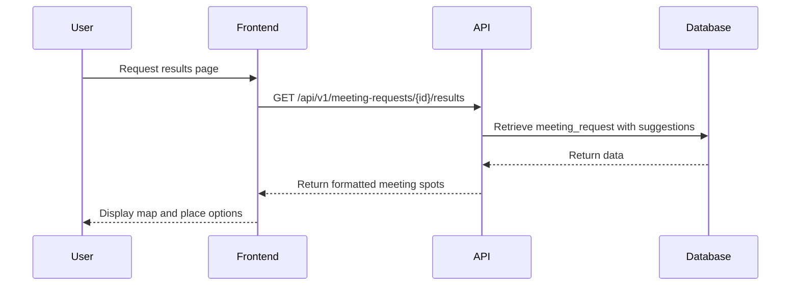

# Meeting Spot Finding - Core Workflow

**Version:** 1.0.0  
**Last Updated:** April 16, 2025  
**Status:** Implementation and Testing Guide

This document outlines the core meeting spot finding workflow in Find A Meeting Spot, including each step of the process, potential failure points, and testing procedures to ensure reliability.

## Table of Contents

1. [Workflow Overview](#workflow-overview)
2. [Technical Flow](#technical-flow)
3. [User Experience Flow](#user-experience-flow)
4. [Testing Procedures](#testing-procedures)
5. [Common Failure Points](#common-failure-points)
6. [Success Metrics](#success-metrics)

## Workflow Overview

The meeting spot finding process consists of these high-level steps:

1. **Create Request**: User A creates a meeting request, providing their location and contact method for User B
2. **Share Link**: User A shares the unique meeting request link with User B
3. **Respond to Request**: User B opens the link and provides their location
4. **Calculate Options**: The system calculates the midpoint and finds appropriate meeting places
5. **View Results**: Both users can view the suggested meeting places
6. **Optional - Save Contact**: User A can save User B's contact information for future meetings

## Technical Flow

### 1. Create Request (User A)



**API Endpoint**: `POST /api/v1/meeting-requests`

**Request Body**:

```json
{
  "address_a": "123 Main St, City",
  "location_type": "Restaurant / Food",
  "user_b_contact_type": "EMAIL",
  "user_b_contact": "userb@example.com",
  "address_a_lat": 37.7749,
  "address_a_lon": -122.4194
}
```

**Response**:

```json
{
  "request_id": "550e8400-e29b-41d4-a716-446655440000",
  "status": "pending_b_address",
  "expires_at": "2025-04-23T14:52:23Z"
}
```

### 2. Respond to Request (User B)



**API Endpoint**: `POST /api/v1/meeting-requests/{id}/respond`

**Request Body**:

```json
{
  "address_b": "456 Market St, City",
  "address_b_lat": 37.7935,
  "address_b_lon": -122.3964,
  "token": "jwt_token_from_url"
}
```

**Response**:

```json
{
  "status": "calculating"
}
```

### 3. View Results (Both Users)



**API Endpoint**: `GET /api/v1/meeting-requests/{id}/results`

**Response**:

```json
{
  "request_id": "550e8400-e29b-41d4-a716-446655440000",
  "status": "completed",
  "suggested_options": [
    {
      "name": "Central Cafe",
      "place_id": "ChIJN1t_tDeuEmsRUsoyG83frY4",
      "address": "123 Mid St, City",
      "location": {
        "lat": 37.7837,
        "lng": -122.4079
      },
      "rating": 4.5,
      "photos": ["https://maps.googleapis.com/..."],
      "distance": 1.2
    }
    // Additional places...
  ],
  "midpoint": {
    "lat": 37.7842,
    "lng": -122.4079
  },
  "locations": {
    "a": { "lat": 37.7749, "lng": -122.4194 },
    "b": { "lat": 37.7935, "lng": -122.3964 }
  }
}
```

## User Experience Flow

### User A: Creating a Meeting Request

1. **Authentication**: User A logs in to their account
2. **Create Request**:
   - User navigates to "Create Meeting" page
   - Enters their location (address or uses current location button)
   - Selects desired meeting place type (restaurant, cafe, etc.)
   - Enters contact method for User B (email or phone)
3. **Share Link**:
   - System generates a unique URL for the meeting request
   - User A copies link and shares with User B via their preferred method
4. **Wait for Response**:
   - User A can view the "waiting" page showing the pending request
   - System shows when User B has responded
5. **View Results**:
   - Once User B responds and the system calculates options, User A can view the suggested meeting places
   - User A can see both locations on the map along with suggested meeting spots

### User B: Responding to a Meeting Request

1. **Access Link**: User B opens the shared link, no login required
2. **View Request**:
   - System shows meeting request details (requester's name, meeting type)
   - Requests User B's location to find a meeting spot
3. **Provide Location**:
   - User B enters their address or uses the current location button
   - Submits their response
4. **Processing Indication**:
   - System shows a "calculating" status while finding meeting spots
5. **View Results**:
   - Once processing completes, User B sees suggested meeting spots
   - User B can view the map with both locations and suggestions

## Testing Procedures

### End-to-End Test Case 1: Basic Success Path

1. **Setup**:
   - Log in as Test User A
   - Navigate to Create Meeting page
2. **Create Request**:
   - Enter "350 5th Ave, New York, NY" as location A
   - Select "Restaurant" as meeting type
   - Enter "test@example.com" as contact email
   - Submit the form
3. **Validation**:
   - Verify redirect to waiting page
   - Copy the meeting request URL
4. **Respond to Request**:
   - Open the URL in a different browser or incognito window
   - Enter "55 E 59th St, New York, NY" as location B
   - Submit the form
5. **Verify Results Calculation**:
   - Monitor the status change from "calculating" to "completed"
   - Verify that suggested meeting spots appear on the results page
   - Verify the map shows both locations and suggestions
   - Verify the suggestions are reasonably between the two locations

### Test Case 2: Geolocation Success Path

1. **Setup**:
   - Log in as Test User A
   - Navigate to Create Meeting page
   - Ensure geolocation is enabled in browser
2. **Create Request**:
   - Use "Use my current location" button
   - Select "Cafe" as meeting type
   - Enter "test@example.com" as contact email
   - Submit the form
3. **Respond with Geolocation**:
   - Open the URL in a different browser
   - Use "Use my current location" button
   - Submit the form
4. **Verify Results**:
   - Verify suggested meeting spots appear
   - Verify appropriate place types (cafes) are prioritized

### Test Case 3: Error Handling

1. **Invalid Address Testing**:
   - Attempt to submit the form with an invalid/nonexistent address
   - Verify appropriate validation errors
2. **Network Failure Testing**:
   - Simulate offline state when submitting location B
   - Verify appropriate error message and retry option
3. **Timeout Testing**:
   - Simulate slow Google Places API response
   - Verify appropriate loading indicators and eventual completion

### Test Case 4: Edge Cases

1. **Long Distance Testing**:
   - Create a request with locations very far apart (different cities)
   - Verify system behavior (should either suggest reasonable options or provide appropriate message)
2. **Same Location Testing**:
   - Submit nearly identical locations for A and B
   - Verify suggestions are still provided

## Common Failure Points

### 1. Geocoding Failures

- **Symptom**: Invalid or unparseable addresses fail to convert to coordinates
- **Testing**: Submit addresses with special characters, very long addresses, or non-existent addresses
- **Resolution**: Ensure robust error handling and user feedback when geocoding fails

### 2. API Rate Limiting

- **Symptom**: Google Places API returns quota exceeded errors during peak usage
- **Testing**: Simulate rapid requests or monitor production logs for rate limit errors
- **Resolution**: Implement exponential backoff and rate limiting on the server side

### 3. Location Permission Denials

- **Symptom**: Users deny location permission when using "current location" button
- **Testing**: Deny permission when prompted and verify fallback behavior
- **Resolution**: Provide clear error messages and alternative manual input options

### 4. Calculation Timeouts

- **Symptom**: Meeting spot calculation takes too long, resulting in timeout
- **Testing**: Monitor performance in different geographic regions
- **Resolution**: Implement background processing for calculations with status polling

## Success Metrics

Use these metrics to evaluate the reliability of the meeting spot finding workflow:

1. **Completion Rate**: % of meeting requests that successfully reach "completed" status

   - Target: >95%

2. **Response Time**: Time from User B submitting location to results being displayed

   - Target: <5 seconds for 90% of requests

3. **Geocoding Success Rate**: % of address inputs successfully converted to coordinates

   - Target: >98%

4. **User Satisfaction**: Survey responses about the quality of suggested meeting places
   - Target: >4.0/5.0 average rating

## Implementation Notes

1. **Resilience Strategies**:

   - Implement retry logic for Google API calls
   - Cache geocoding results where possible
   - Use progressive radius expansion when initial search returns no results

2. **Performance Considerations**:

   - Pre-calculate and cache common location data
   - Optimize database queries around meeting request status checks
   - Consider background processing for calculation-intensive operations

3. **Testing Requirements**:
   - Run automated end-to-end tests daily covering the main workflow
   - Perform manual spot-checks in different geographic regions
   - Monitor error rates and calculation times in production
